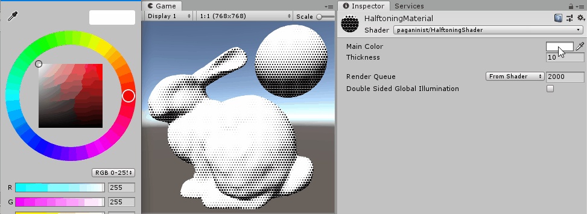

# unity-halftonize

Unity project for generating halftone style art in 3d environment.

 The table below shows the rendering result through different combination of parameter values.
 The unity scene file for the images in the table is stored at Assets/Scenes/Sample/BunnyScene.unity

<table style="table-layout: auto; border-collapse: collapse;width: 100%;">
<tr>
<th></th>
<th style="text-align:center">Main Color: #FFFFFF</th>
<th style="text-align:center">Main Color: #AAAAAA</th>
</tr>
<!-- Line 1: Thickness : 5 -->
<tr>
<td style="white-space: nowrap;">Thickness: 5</td>
<td></td>
<td></td>
</tr>
<!-- Line 2: Thickness : 10 -->
<tr>
<td style="white-space: nowrap;"">Thickness: 10</td>
<td></td>
<td></td>
</tr>
<!-- Line 3: Thickness : 15 -->
<tr>
<td style="white-space: nowrap;"">Thickness: 15</td>
<td></td>
<td></td>
</tr>
</table>

## Getting Started

### Prerequisites

- \>= Unity 2018.4.21f

- No dependency for packages so far.

## Limitation

- Currently Main Color parameter
- Poor interface for parameter customization

## Contributing

Any type of code contribution or feedback will be welcomed.

## License

See the file LICENSE.md.

